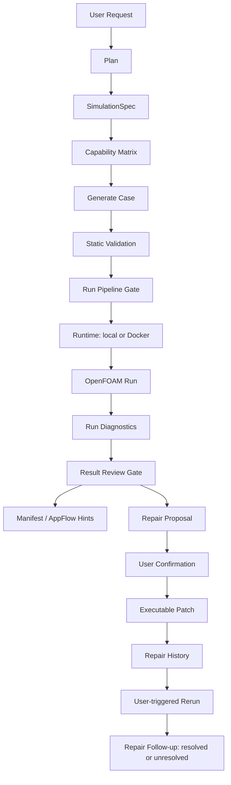

# OpenFOAM Agent 项目分析与甲方汇报材料

日期：2026-05-29  
项目范围：`AgentBridge`，重点为 `chat_ui_backend/scripts` 下的 OpenFOAM Agent 后端链路。

## 1. 汇报结论

当前版本已经形成一个面向 OpenFOAM 的单求解器 Agent MVP。它不只是“调用 OpenFOAM 的脚本”，而是具备了从需求理解、计划落地、case 生成、静态校验、运行执行、日志诊断、结果审查、修复建议、用户确认修复、重跑跟踪的完整闭环。

可以对甲方明确表达：

- 项目当前重点聚焦 OpenFOAM，没有盲目扩展多求解器。
- 已具备可演示的端到端工作流，尤其是 `rect_channel` generated case。
- 支持 local 和 Docker 两类 OpenFOAM runtime，其中 local 是长期默认主路径，Docker 是当前开发和交付演示的可运行后端。
- Agent 能识别部分 OpenFOAM 运行失败原因，并把部分问题转为可执行 repair patch。
- 系统保留用户确认机制，不会在失败后自动乱改 case，也不会自动重跑。
- 当前版本适合定义为“OpenFOAM Agent 第一阶段工程样机”，尚未达到完整生产级 CFD 平台。

## 2. 当前系统定位

本项目当前更适合定位为：

> 面向 OpenFOAM 的本地仿真 Agent 后端，负责把用户自然语言需求转成受控的 OpenFOAM 工作流，并为 AppFlow/上层 UI 输出结构化 manifest 和操作建议。

它当前不是：

- 多求解器统一平台；
- 任意复杂几何自动建模系统；
- 完整 CFD 物理可信性判定系统；
- 全自动无人确认修复系统；
- 替代 CFD 工程师的黑盒求解器。

这个定位是合理的。原因是 CFD Agent 最容易失败的地方不是“会不会生成文件”，而是“是否能把生成、运行、失败诊断、修复和结果展示做成稳定闭环”。当前版本已经在这条主线上打下了比较清楚的基础。

## 3. 项目结构概览

核心目录：

```text
AgentBridge/
  chat_ui_backend/
    scripts/
      agent_service.py
      simagent_core/
        agent/
        gates/
        manifest/
        repair/
        router/
        solvers/
          openfoam/
        spec/
        state/
        workflow/
      tests/
```

关键模块说明：

| 模块 | 作用 |
| --- | --- |
| `agent_service.py` | 本地 HTTP 服务入口，提供 `/foam/plan`、`/foam/generate`、`/foam/validate`、`/foam/run`、`/foam/repair-action` 等接口 |
| `simagent_core/spec` | `SimulationSpec` 结构，承接规范化后的仿真计划 |
| `solvers/openfoam/plan.py` | OpenFOAM 规划逻辑，将用户需求转成 `SimulationPlan` |
| `solvers/openfoam/capabilities.py` | OpenFOAM capability matrix，明确支持、部分支持和不支持范围 |
| `solvers/openfoam/generated/rect_channel.py` | 稳定生成二维/薄三维矩形通道 OpenFOAM case |
| `solvers/openfoam/validate.py` | OpenFOAM 文件、字典、patch、boundary、field 校验 |
| `solvers/openfoam/runtime.py` | local / Docker / WSL runtime 检测与 runner 抽象 |
| `solvers/openfoam/run_local.py` | OpenFOAM pipeline 执行入口，接入 runtime、pipeline gate、diagnostics |
| `solvers/openfoam/run_diagnostics.py` | OpenFOAM 日志诊断解析 |
| `gates/result_review_gate.py` | 运行结果审查 gate，决定是否可展示、是否建议 repair/rerun |
| `repair/proposals.py` | 从 gate review/diagnostics 生成 repair action |
| `repair/patches.py` | 可执行 repair patch，事务式应用 |
| `state/task_store.py` | task 状态、repair history、repair follow-up |
| `manifest/writer.py` | 输出 AppFlow 可消费的 manifest 和 hints |
| `tests/` | 单元测试、HTTP smoke、runtime mock、scenario regression、Docker opt-in E2E |

## 4. 核心工作流

当前 OpenFOAM Agent 的主链路如下：



这条链路的关键价值在于：Agent 不只是执行命令，而是能把仿真任务拆成若干受控阶段，并在每个阶段给出结构化状态。

## 5. 已完成能力分析

### 5.1 SimulationSpec 规范化

当前项目已经将 OpenFOAM 计划落到 `SimulationSpec`，包括：

- geometry；
- mesh；
- physics；
- boundaries；
- solver；
- numerics；
- outputs。

重要质量点：

- reference plan 不再盲目信任 LLM 返回的 `parameters["simulation_spec"]`；
- deterministic generated case 会保留可信 spec；
- reference plan 会从规范化后的 `SimulationPlan` 重建 canonical spec；
- 这降低了 LLM 污染仿真规格的风险。

评价：这是 Agent 项目里非常关键的一步。CFD 文件生成不能直接依赖 LLM 自由文本，必须先落到结构化 spec。

### 5.2 OpenFOAM Capability Matrix

当前 capability matrix 已能区分：

- generated rect_channel 支持；
- reference copy 支持；
- reference modify 仅对明确登记的 modifier 支持；
- arbitrary reference 不再过度承诺；
- unsupported / partial / needs_user_input 能进入 gate。

评价：这个机制对甲方很重要。它体现了系统不会假装“什么都能做”，而是会把能力边界显式暴露出来。

### 5.3 OpenFOAM 静态校验

当前 `validate.py` 支持：

- 必要文件检查；
- FoamFile object 检查；
- `controlDict` application 检查；
- `physicalProperties` 中 `nu` 检查；
- 初始场 dimensions 检查；
- blockMeshDict / polyMesh boundary patch 提取；
- `0/U`、`0/p` 等 field patch 对齐检查；
- missing / extra / empty boundary field 检查；
- boundary condition error 和 warning 分级。

评价：这是从“生成能写文件”到“生成的 case 有基本一致性”的重要进步。warning 不阻断 run 的设计也比较工程化，避免把可运行但不推荐的设置直接判死。

### 5.4 Stable generated rect_channel

`rect_channel` 目前是系统最稳定的 generated case。支持：

- 中英文 prompt 参数提取；
- 长度、高度/宽度、深度；
- 入口速度；
- 运动黏度；
- 网格密度；
- `endTime`；
- `deltaT`；
- 非正数回退默认稳定值；
- blockMesh + icoFoam pipeline；
- `blockMeshDict` patch 与 `0/U`、`0/p` 完全一致；
- `controlDict` 含 `adjustTimeStep no`、`maxCo 0.5`、`maxDeltaT`。

评价：这是当前最适合现场演示的 case。建议甲方演示时主打它，不要现场临时尝试复杂 case。

### 5.5 Runtime 与执行后端

当前 runtime 设计包括：

- `local` backend：默认主路径；
- `docker` backend：通过环境变量启用；
- `wsl` backend：当前只检测，不执行，明确 blocked；
- `CommandProbe`；
- `SubprocessCommandExecutor`；
- `OpenFOAMRunner`；
- `DockerOpenFOAMRunner`。

Docker 启用方式：

```powershell
$env:SIMAGENT_OPENFOAM_BACKEND="docker"
$env:SIMAGENT_OPENFOAM_DOCKER_IMAGE="leoyue123/foamagent:latest"
$env:SIMAGENT_OPENFOAM_DOCKER_CASE_DIR="/case"
```

Docker 运行命令形态：

```text
docker run --rm -v <host_case_dir>:/case -w /case leoyue123/foamagent:latest blockMesh
```

评价：

- 当前 Docker backend 对没有本地 OpenFOAM 的演示环境很有价值；
- 代码没有把 Docker 写死成唯一后端，保留了后期 local 主路径；
- WSL 没有假装可执行，这是正确边界。

### 5.6 Run Diagnostics

当前 `run_diagnostics.py` 能从 blockMesh / solver log 中识别：

- blockMesh 失败；
- missing boundary field；
- unknown patch；
- Courant number 过高；
- nan / inf；
- divergence；
- high residual；
- command timeout；
- command non-zero exit；
- warning log。

输出为结构化 diagnostics：

```json
{
  "severity": "passed|warning|failed",
  "summary": "...",
  "items": [
    {
      "code": "result.residual_nan",
      "severity": "error",
      "category": "numerics",
      "message": "...",
      "source": "icoFoam",
      "log_file": "logs/icoFoam.log",
      "matched_line": "..."
    }
  ],
  "metrics": {
    "has_nan_or_inf": true,
    "max_courant": 3.2
  }
}
```

评价：这是当前版本最有 Agent 味道的部分。CFD 中命令返回 0 不代表结果可信，当前系统已经能基于日志把 nan、divergence、high residual 判成失败。

### 5.7 Result Review Gate

`result_review_gate.py` 把 run status 和 diagnostics 转成统一结论：

```json
{
  "status": "passed|warning|failed",
  "summary": "...",
  "can_show_results": true,
  "should_offer_repair": false,
  "should_offer_rerun": false,
  "should_offer_vtk": true,
  "should_offer_paraview": true,
  "has_raw_results": true,
  "has_vtk_results": false,
  "latest_result_path": "case/0.5",
  "repair_mode": "none"
}
```

关键行为：

- `run_failed` / `run_blocked` 不会被误判为 passed；
- diagnostics failed 必定导致 review failed；
- warning-only diagnostics 可以保持 warning 且允许展示结果；
- 没有有效时间目录或 VTK 时，`can_show_results=false`；
- AppFlow hints 优先消费 result_review，不在 writer 里重复复杂推断。

评价：这一层让系统从“脚本执行结果”变成“可被上层 UI/AppFlow 消费的工作流结论”。

### 5.8 Repair Action 与事务式 Patch

当前 repair 支持两类：

- manual action：只记录建议，不自动修改；
- executable action：用户确认后执行 patch。

已支持的 patch op：

- `set_dictionary_value`；
- `add_missing_boundary_field`；
- `adjust_time_step`；
- `enable_adjust_time_step`；
- `update_solver_tolerance`。

安全设计：

- path 必须在当前 task 的 `case/` 下；
- 禁止 `..`；
- 禁止绝对路径；
- schema 校验 op、path、identifier、数值合法性；
- 两阶段事务式 prepare；
- 多个 patch 修改同一文件时，后一个基于 staged content；
- 任何 patch 失败则整体不写盘；
- HTTP 400 时不记录成功 history。

评价：这部分设计比较成熟。尤其是事务式 patch 和路径限制，对 Agent 安全非常关键。

### 5.9 Repair Follow-up

当前 repair history 已记录：

- `repair_action_id`；
- `repair_mode`；
- `related_diagnostic_codes`；
- `related_diagnostic_categories`；
- `patch_result`；
- `status`；
- `created_at`。

下一次 `/foam/run` 后会计算：

```json
{
  "status": "resolved|unresolved|unknown",
  "resolved_codes": ["result.missing_boundary_field"],
  "unresolved_codes": [],
  "checked_at": "..."
}
```

评价：这是闭环能力。Agent 能回答“我修了什么，修完以后问题有没有消失”，而不是只给一次性建议。

### 5.10 Manifest / AppFlow 输出

`ManifestWriter` 当前输出：

- workflow 状态；
- gate summaries；
- validation；
- run；
- runtime_info；
- diagnostics；
- result_review；
- repair_history；
- last_repair_action；
- repair_followup；
- artifacts；
- appflow_hints。

典型 AppFlow hints：

- `show_results`；
- `open_paraview`；
- `run_foam_to_vtk`；
- `offer_repair`；
- `offer_rerun`；
- `runtime_backend`；
- `runtime_available`；
- `run_diagnostics_summary`；
- `has_suggested_repair_actions`。

评价：后端已经把复杂判断尽量收敛成结构化字段，降低了上层 UI 的判断压力。

## 6. 测试覆盖与质量证据

当前测试覆盖范围较完整：

- import / state model；
- router policy；
- SimulationSpec；
- capability matrix；
- generated rect_channel；
- OpenFOAM boundary validation；
- OpenFOAM modifiers；
- gmsh mesh；
- run pipeline；
- runtime local / Docker mock；
- run diagnostics；
- result review gate；
- repair proposals；
- appflow manifest writer；
- HTTP smoke；
- agent replies；
- scenario-level regression；
- opt-in Docker E2E。

本次复核执行结果：

```text
PYTHONDONTWRITEBYTECODE=1 python -m unittest discover -s AgentBridge/chat_ui_backend/scripts/tests

Ran 207 tests in 6.860s
OK (skipped=1)
```

其中 1 个 skipped 是 Docker E2E，默认跳过，只有设置环境变量后才执行：

```powershell
$env:SIMAGENT_OPENFOAM_E2E="1"
$env:SIMAGENT_OPENFOAM_BACKEND="docker"
```

新增场景级测试锁住了三条关键链路：

1. generated rect_channel happy path；
2. missing boundary field -> repair -> rerun resolved；
3. nan/divergence -> failed review -> repair suggestion -> rerun unresolved。

评价：测试策略是当前项目的强项。不是只测函数，而是已经开始测业务闭环。

## 7. 当前成熟度评估

| 维度 | 评分 | 说明 |
| --- | --- | --- |
| 架构清晰度 | 8/10 | plan、spec、gate、runtime、repair、manifest 分层清楚 |
| OpenFOAM 单链路完整度 | 8/10 | 从生成到运行诊断、repair follow-up 已闭环 |
| 测试质量 | 8/10 | 单测、HTTP smoke、scenario regression、Docker opt-in E2E 均有覆盖 |
| Docker 演示可用性 | 7/10 | 已可执行，但仍是基础 bind mount 模式 |
| CFD 物理可信性判断 | 4/10 | 目前主要判断运行稳定性，还没有深入物理 sanity gate |
| 复杂 case 泛化能力 | 4/10 | 当前稳定 case 族较少，主要依赖 rect_channel 和 reference |
| 生产稳定性 | 6/10 | 主链路稳定，但真实 OpenFOAM log 样本和长时间运行验证还不足 |

总体评价：

> 当前版本适合作为“OpenFOAM Agent 第一阶段工程样机 / MVP milestone”向甲方展示。它已经具备工程闭环和可验证行为，但还不应承诺为完整自动化 CFD 平台。

## 8. 适合向甲方展示的亮点

### 8.1 受控生成，而不是 LLM 直接写 case

系统将自然语言需求先落到 `SimulationSpec`，再由受控 writer 生成 OpenFOAM 字典。这样比直接让 LLM 输出 OpenFOAM 文件更可靠。

### 8.2 能力边界透明

Capability matrix 会告诉系统哪些需求支持、部分支持、不支持。这样可以避免 Agent 过度承诺。

### 8.3 运行失败可诊断

系统能识别 OpenFOAM log 中的典型错误，例如 Courant 过高、nan、divergence、missing patch field，而不是只告诉用户“运行失败”。

### 8.4 修复动作需要用户确认

Agent 可以提出 repair action，但必须用户确认后才 patch，不会自动修改 case。

### 8.5 修复后可追踪效果

repair follow-up 能记录 rerun 后相关 diagnostic 是否消失。这是工程 Agent 很重要的闭环。

### 8.6 Docker 支持降低部署门槛

即使当前机器没有 local OpenFOAM，也可以通过 Docker backend 跑通演示链路。

## 9. 建议现场演示路线

建议不要现场尝试复杂随机 case。推荐演示稳定链路：

### 演示 1：rect_channel 正常链路

输入需求示例：

```text
生成一个二维矩形通道，长度 3，高度 0.5，入口速度 1，运动黏度 0.01，endTime 1，deltaT 0.005
```

展示点：

- plan 生成；
- SimulationSpec；
- OpenFOAM case 文件；
- validate 通过；
- Docker run；
- result_review passed；
- manifest 输出 `show_results` / `run_foam_to_vtk`。

### 演示 2：边界字段缺失修复

人为制造 `0/U` 缺少某个 patch 的场景。

展示点：

- validation 或 diagnostics 发现 missing boundary field；
- proposal 生成 `repair_case_dictionaries`；
- 用户确认后 patch；
- repair_history 记录；
- rerun 后 repair_followup resolved。

### 演示 3：数值发散诊断

使用 mock 或准备好的 solver log 展示 nan/divergence。

展示点：

- 即使命令返回 0，diagnostics 也可判 failed；
- result_review 阻止假成功；
- 给出 stabilize timestep / inspect numerics 建议；
- rerun 后如果同类问题仍存在，follow-up 标记 unresolved。

## 10. 当前限制与风险

### 10.1 真实日志样本不足

当前 parser 覆盖高价值 OpenFOAM log 模式，但真实工程 case 失败形态很多。后续需要收集更多真实 Docker/OpenFOAM 日志来迭代 parser。

### 10.2 物理可信性判断不足

当前更多判断“是否能跑”和“是否数值失败”，还没有深入判断：

- 质量守恒；
- 入口出口通量；
- 压降是否合理；
- Reynolds 数与 solver 是否匹配；
- 时间步和 CFL 是否与物理目标一致；
- 边界条件是否符合工程问题。

### 10.3 Repair 仍以小修为主

当前 executable repair 适合修字典和数值控制项，例如 boundary field、deltaT、tolerance。对于网格质量差、几何错误、物理模型不合适，目前主要只能给 manual review。

### 10.4 Case 覆盖仍窄

当前最稳定的是 generated rect_channel。reference case 支持 copy 和部分修改，但不应承诺任意 OpenFOAM tutorial 都能自动正确修改。

### 10.5 Docker backend 仍是基础版本

当前 Docker 支持单 case bind mount 执行 pipeline。尚未支持：

- MPI / parallel；
- GPU；
- 复杂 volume mapping；
- image 内命令预检；
- 大规模计算资源调度。

### 10.6 Windows 本地 HTTP smoke 曾有偶发连接中止

当前复核测试通过，但此前出现过一次 Windows 本地 HTTP smoke 偶发连接中止。若复现，应单独检查 server readiness、端口释放、timeout 和 shutdown 顺序。

## 11. 下一阶段建议

建议后续继续保持“先打磨 OpenFOAM，不扩多求解器”的策略。

### 阶段 A：真实日志驱动 diagnostics 增强

目标：

- 收集 10-20 条真实 OpenFOAM 成功/失败日志；
- 按类型补 parser；
- 每个 parser 模式配测试；
- 不追求一次识别所有错误。

优先错误类型：

- pressure reference missing；
- inconsistent patch type；
- Courant runaway；
- continuity error abnormal；
- checkMesh severe non-orthogonality；
- zero / negative volume；
- turbulenceProperties 缺失或模型不匹配；
- fvSolution solver block 缺失。

### 阶段 B：Physics Sanity Gate

先只针对 rect_channel 做轻量物理检查：

- Re 数计算；
- solver 与 Re 范围是否匹配；
- 入口速度、nu、几何尺度是否为正；
- `deltaT` 对应估计 CFL 是否合理；
- 输出时间目录是否包含目标 fields；
- 压力/速度结果是否存在基本异常。

目标不是替代 CFD 工程判断，而是防止明显不可信结果被展示为成功。

### 阶段 C：结果摘要与报告

基于 diagnostics、result_review、manifest 生成用户可读报告：

- 本次 case 参数；
- 运行环境；
- pipeline；
- 运行状态；
- 主要 diagnostics；
- repair history；
- 是否建议查看结果；
- 下一步建议。

这对甲方验收和演示很有帮助。

### 阶段 D：Docker E2E 稳定化

在可控机器上定期跑：

```powershell
$env:SIMAGENT_OPENFOAM_E2E="1"
$env:SIMAGENT_OPENFOAM_BACKEND="docker"
python -m unittest tests.test_openfoam_docker_e2e
```

目标是把 Docker 演示环境变成稳定基线。

## 12. 甲方沟通建议

建议使用如下表述：

> 当前系统已经完成 OpenFOAM 单求解器 Agent 的第一阶段闭环。我们重点没有放在广泛堆功能，而是先把仿真任务从自然语言到 spec、case、validate、run、diagnostics、review、repair、rerun follow-up 的链路打通。这样做的好处是，每一步都有结构化状态和可追踪证据，后续扩展能力时不会失控。

需要避免的表述：

- “任意 OpenFOAM case 都能自动生成并修复”；
- “可以完全自动判断 CFD 结果正确”；
- “已经支持多求解器生产级调度”；
- “Docker/local/WSL 全部完整可执行”。

建议承诺：

- 当前可稳定演示 generated rect_channel；
- 当前可展示 Docker 后端运行；
- 当前可展示 diagnostics 和 repair follow-up；
- 后续将通过真实日志和物理 sanity gate 继续增强可靠性。

## 13. 验收建议

建议甲方第一阶段验收标准定义为：

1. 能通过自然语言生成 rect_channel OpenFOAM case；
2. 生成 case 可通过静态 validation；
3. 能在 Docker 或 local OpenFOAM backend 下运行基础 pipeline；
4. run_result 包含 runtime_info、logs、outputs、diagnostics；
5. result_review 能判断是否可展示结果；
6. missing boundary field 等典型问题能生成 repair proposal；
7. 用户确认 repair 后能修改 case；
8. rerun 后能标记 repair_followup resolved / unresolved；
9. manifest 能给 AppFlow 提供 show_results、offer_repair、offer_rerun 等 hints；
10. 全量测试通过，Docker E2E 作为 opt-in 环境测试。

## 14. 总体评价

从工程角度看，当前项目最值得肯定的不是某一个单点功能，而是已经形成了可维护的 Agent 工作流结构：

- 用 spec 抑制 LLM 不确定性；
- 用 capability matrix 抑制过度承诺；
- 用 validation gate 抑制坏 case；
- 用 runtime abstraction 保持 local/Docker 后端清晰；
- 用 diagnostics 把运行日志转成结构化证据；
- 用 result_review 防止假成功；
- 用 repair action 和事务式 patch 做受控修复；
- 用 repair_followup 追踪修复效果；
- 用 scenario tests 锁住核心闭环。

当前版本可以作为一个稳定 milestone。下一步最重要的不是继续扩功能，而是用真实 OpenFOAM 日志和物理 sanity checks 把它打磨成更可信的工程 Agent。
